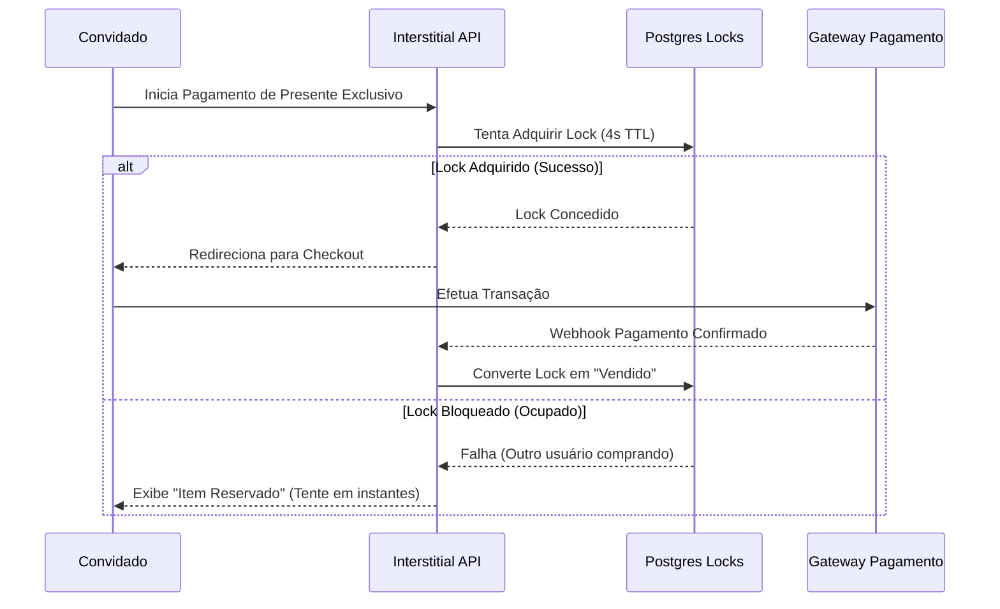
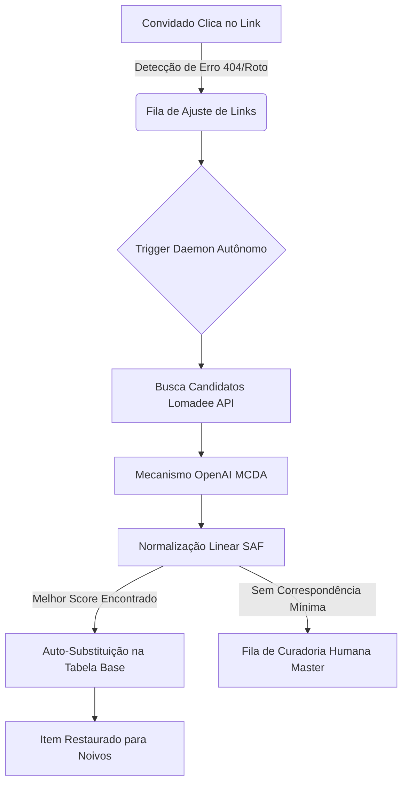

# InviteEventAI — Plataforma SaaS de Gestão Premium 💍

O **InviteEventAI** é uma sofisticada plataforma SaaS corporativa para a gestão de convites de casamento digitais, RSVP inteligente, galerias interativas de fotos e uma robusta suíte de **Smart Gift List** (catálogo unificado de presentes monetizado via afiliados com cura autônoma baseada em IA).

---

## 🏛️ Arquitetura do Ecossistema

A plataforma adota um paradigma moderno de microsserviços integrados via **Next.js 16 (App Router)** servido na **Vercel**, utilizando o **Supabase** como BaaS transacional de alta segurança.

### Principais Pilares Arquiteturais:

1. **Camada de Autenticação & RLS (Row Level Security):** Proteção estrita no banco de dados garantindo que noivos visualizem apenas seus dados e que os administradores operem com isolamento total via tokens JWT nativos.
2. **Smart Gift List Engine:** Separação física entre transações locais (`presentes`) e o repositório global de fornecedores SaaS (`presentes_base`), garantindo governança e escalabilidade.
3. **Atomic Checkout Routing:** Travamento temporário atômico (`presentes_locks`) de 4 segundos, impedindo *race conditions* (dois convidados pagando o mesmo presente simultâneo).
4. **AI Self-Curing Daemon:** Agente autônomo que intercepta links quebrados (Amazon/Magalu), busca alternativas no Lomadee API e utiliza a metodologia MCDA com Normalização Linear SAF para auto-substituir itens rompidos sem interferência humana.

---

## 📊 Diagramas de Fluxo e Visão de Desenvolvimento

### 1. Ciclo de Vida do Smart Checkout (Controle Atômico)



### 2. Daemon de Auto-Cura de Links Quebrados (AI Agent)



---

## 🔑 Configuração de Variáveis de Ambiente (`.env`)

Crie um arquivo `.env` ou `.env.local` na raiz baseado no `.env.example`.

| Chave | Origem/Finalidade | Obrigatoriedade |
|---|---|---|
| `NEXT_PUBLIC_SUPABASE_URL` | Supabase Project API URL | **Crítico** |
| `NEXT_PUBLIC_SUPABASE_ANON_KEY` | Chave JWT pública | **Crítico** |
| `SUPABASE_SERVICE_ROLE_KEY` | Acesso master administrativo (bypass RLS) | **Crítico** (Backend) |
| `DATABASE_URL` | Connection String Postgres direto para Migrations | Opcional (CLI) |
| `NEXT_PUBLIC_STRIPE_PUBLISHABLE_KEY` | Public Key para formulários de pagamento | Opcional |
| `STRIPE_SECRET_KEY` | Processamento financeiro e geração de intents | Opcional |
| `STRIPE_WEBHOOK_SECRET` | Escuta de confirmações de transações Stripe | Opcional |
| `NEXT_PUBLIC_CLOUDINARY_CLOUD_NAME` | Bucket de fotos do Mural e Presentes | **Crítico** |
| `OPENAI_API_KEY` | Chave de processamento para o Agente MCDA de Auto-cura | **Crítico** (Fase Autônoma) |
| `MAGALU_STORE_NAME` | Nome da loja parceira no Magazine Luiza | Opcional |
| `AMAZON_AFFILIATE_TAG` | Tag de tracking de comissionamento Amazon | Opcional |

---

## 🚦 Desenvolvimento e Engenharia de Qualidade

O projeto possui uma rígida política de qualidade baseada em três camadas de verificação contínua:

### 1. Scripts Disponíveis no Terminal

```bash
# 1. Instalando dependências
npm install

# 2. Executar servidor local de desenvolvimento
npm run dev

# 3. Rodar compilação de produção (Certificação de Build)
npm run build

# 4. Executar testes unitários (Jest)
npm test

# 5. Executar testes de integração E2E (Playwright)
npm run test:e2e
```

### 2. Filosofia de Testes e Cobertura

- **Testes Unitários (Jest):** Focam em segurança matemática de algoritmos de relevância do Agente de IA, parsing de dados de webhook e serviços de persistência direta.
- **Testes de Integração E2E (Playwright):** Simulam o comportamento real do navegador. São utilizados para validar:
  - Concorrência de checkout em milissegundos.
  - Fluxos de cadastro administrativo e aprovação de presentes customizados.
  - Renderização em dispositivos móveis.
- **Compilação de Estabilidade:** Todo deploy exige que o comando `npm run build` execute sem nenhuma falha em tempo de compilação TypeScript/Next.js, garantindo a sanidade da árvore de exportação estática.

---

## 🤖 O Loop de IA Multi-Agent (@maestro)

O desenvolvimento deste ecossistema segue um fluxo orquestrado por agentes inteligentes com papéis definidos no protocolo global `GEMINI.md`:

- **@maestro:** Orquestrador central que governa o roadmap de PRDs e delega fases.
- **@ba:** Define os PRDs funcionais focados no impacto financeiro e de usuário.
- **@ux-ui:** Garante a estética Premium escura do cockpit e a responsividade elegante das áreas públicas.
- **@architect:** Projeta estruturas de bancos de dados, tabelas atômicas e gateways de segurança.
- **@dev / @ai-eng:** Implementação de lógica e engenharia avançada em LLM.
- **@qa:** Validação de suítes de testes, análise de cobertura e simulações de invasão.
- **@devops:** Versionamento semântico, sanidade de repositório e triggers de deploy.

---
*Desenvolvido com carinho técnico e engenharia premium. Pronto para escalar o sonho do grande dia!* 💍🥂✨
