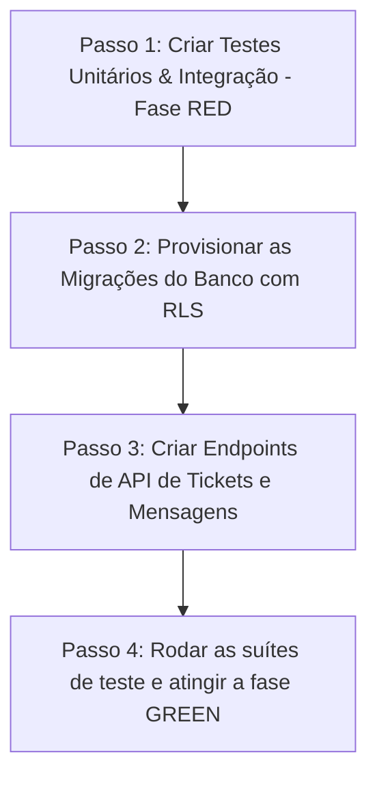

# Plano de Implementação Detalhada — PRD-003 (Fase 1) 🧭
> Responsável: Arquiteto de Software | Data: 2026-05-09 | Status: PLANEJAMENTO (Em Revisão)

Este documento especifica o plano de execução passo a passo para a **Fase 1: Infraestrutura de Banco de Dados e APIs do Suporte por Chat**, focando no ciclo de vida robusto, conformidade de segurança e ciclo TDD (escrever testes antes do código).

---

## 1. Escopo Técnico da Fase 1

### 1.1. Banco de Dados (Supabase/PostgreSQL)
Implementação de duas tabelas de suporte com relacionamentos consistentes, enum de status customizado e índices adequados para garantir respostas rápidas.

-   **Enum Customizado**: `support_status` ('aguardando_atendimento', 'em_atendimento', 'finalizado', 'cancelado').
-   **Tabela `suporte_tickets`**:
    -   `id` (UUID, Primary Key, padrão `gen_random_uuid()`).
    -   `usuario_id` (UUID, Foreign Key apontando para `auth.users(id)` com `on delete cascade`).
    -   `evento_id` (UUID, Foreign Key apontando para `public.eventos(id)` com `on delete set null`).
    -   `status` (`support_status`, padrão `'aguardando_atendimento'`).
    -   `created_at` e `updated_at` (Timestamps UTC com fuso horário padrão).
-   **Tabela `suporte_mensagens`**:
    -   `id` (UUID, Primary Key, padrão `gen_random_uuid()`).
    -   `ticket_id` (UUID, Foreign Key apontando para `public.suporte_tickets(id)` com `on delete cascade`).
    -   `remetente_id` (UUID, Foreign Key apontando para `auth.users(id)` com `on delete cascade`).
    -   `conteudo` (Text, conteúdo bruto da mensagem).
    -   `created_at` (Timestamp UTC).

### 1.2. Políticas Robustas de RLS (Row Level Security)
Seguindo as regras rígidas do **DevOps**, cada tabela terá o RLS ativo com as seguintes regras de negócio aplicadas no Postgres:

1.  **`suporte_tickets`**:
    *   `ENABLE ROW LEVEL SECURITY`.
    *   **SELECT**: `auth.uid() = usuario_id` OU o usuário ativo possuir a claim customizada de Master Admin (`auth.jwt() ->> 'role' = 'master'`).
    *   **INSERT**: `auth.uid() IS NOT NULL` (apenas usuários cadastrados e autenticados podem abrir tickets). O `usuario_id` deve obrigatoriamente ser preenchido com `auth.uid()`.
    *   **UPDATE**: Permitido apenas para o Master Admin para gerenciar o andamento (`em_atendimento`, `finalizado`, `cancelado`).
2.  **`suporte_mensagens`**:
    *   `ENABLE ROW LEVEL SECURITY`.
    *   **SELECT**: Permitido se o usuário autenticado for o criador do ticket associado ou for Master Admin.
    *   **INSERT**: Permitido se o `remetente_id` for o `auth.uid()` ativo, E o usuário for participante legítimo do ticket (ou o criador do ticket ou Master Admin).

---

## 2. Endpoints de API (Next.js App Router)

Desenvolveremos rotas na pasta `src/app/api/support/`:

1.  **`src/app/api/support/tickets/route.ts`**:
    *   `GET`: Lista todos os tickets ativos. Se for usuário normal, retorna apenas os seus. Se for Master, retorna todos os pendentes e abertos da plataforma ordenados pelo tempo restante do SLA (padrão de 2h).
    *   `POST`: Cria um novo ticket, autocompletando o `usuario_id` a partir da sessão autenticada.
2.  **`src/app/api/support/messages/route.ts`**:
    *   `GET`: Lista as mensagens de um ticket enviado via query-param `?ticketId=...`.
    *   `POST`: Insere uma nova mensagem na tabela de forma transacional.
3.  **`src/app/api/support/tickets/[id]/route.ts`**:
    *   `PATCH`: Permite que o Master atualize o status do ticket.

---

## 3. Estratégia de Testes TDD (Garantia de Qualidade)

Focando no feedback de robustez, antes de escrever o código de migração e das rotas de API, criaremos as suítes de testes em fase **RED**:

### 3.1. Testes Unitários de Banco e RLS
*   Local: `tests/unit/support_db.test.ts`.
*   **Cenários Testados**:
    1.  Inserção bem-sucedida de tickets por usuários autenticados.
    2.  Tentativa de um usuário visualizar os tickets de outro (deve falhar por RLS).
    3.  Master Admin visualizando e atualizando status de qualquer ticket (deve funcionar com sucesso).

### 3.2. Testes de Integração de API
*   Local: `tests/integration/support_api.test.ts`.
*   **Cenários Testados**:
    1.  `POST /api/support/tickets` sem autenticação deve retornar status `401 Unauthorized`.
    2.  `POST /api/support/tickets` autenticado deve retornar status `201 Created` e persistir o ticket.
    3.  `PATCH /api/support/tickets/[id]` por usuário não-master deve retornar status `403 Forbidden`.

---

## 4. Plano de Ação Passo a Passo

1.  **Passo 1 (RED)**: Criar os arquivos de teste `tests/unit/support_db.test.ts` e `tests/integration/support_api.test.ts` simulando os fluxos em vermelho.
2.  **Passo 2**: Implementar o arquivo de migração SQL na pasta `supabase/migrations/` contendo a DDL e políticas de RLS descritas.
3.  **Passo 3**: Implementar as rotas da API em Next.js.
4.  **Passo 4 (GREEN)**: Executar `npm run test` e verificar se toda a infraestrutura está perfeitamente testada e aprovada, com cobertura impecável.
