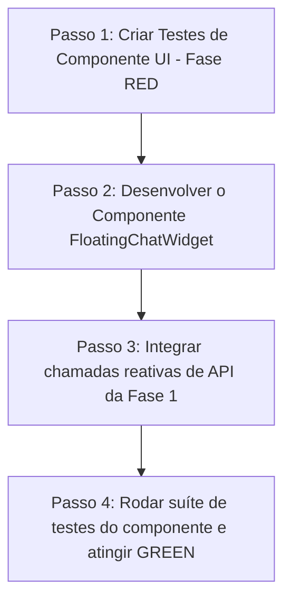

# Plano de Implementação Detalhada — PRD-003 (Fase 2) 🧭
> Responsável: Arquiteto de Software | Data: 2026-05-09 | Status: PLANEJAMENTO (Em Revisão)

Este documento especifica o plano de execução passo a passo para a **Fase 2: Interface do Usuário (Botão Flutuante e Widget de Chat de Suporte)**, focado em criar um design premium, reativo, com cálculo de SLA e ciclo TDD (escrever testes antes do código).

---

## 1. Escopo de Design & Funcionalidades da Fase 2

### 1.1. Botão Flutuante de Suporte (`src/components/support/FloatingChatWidget.tsx`)
*   **Aparência**: Botão circular sofisticado no canto inferior direito (`bottom-6 right-6`), fundo em Midnight Ink (`#0a0b10`), com brilho dourado (`#dfb86c`) em hover, contendo um ícone de chat e micro-animação de flutuação suave.
*   **Comportamento**: Ao clicar, abre o painel flutuante do chat e minimiza ao clicar novamente.

### 1.2. Painel do Chat Widget (Lado do Usuário)
*   **Cabeçalho**: Título de suporte com o status do ticket ativo e indicador regressivo de SLA de 2h baseado no `created_at` do ticket.
*   **Lista de Conversas**: Área com scroll automático que exibe as mensagens estilizadas (alinhadas à direita em Royal Gold para o usuário, alinhadas à esquerda em Midnight Gray para o atendente/Master).
*   **Área de Input**: Campo de texto premium com botão dourado com ícone de seta (`发送/Enviar`) para registrar as mensagens de forma reativa.

### 1.3. Cálculo e Exibição de SLA
*   **Lógica**: Se houver um ticket aberto no status `'aguardando_atendimento'` ou `'em_atendimento'`, calcula a diferença de tempo: `Tempo Restante = 2 horas - (Agora - created_at)`.
*   **Sinalizadores Visuais**:
    *   **Verde**: `Tempo Restante > 1 hora`.
    *   **Amarelo**: `30 minutos <= Tempo Restante <= 1 hora`.
    *   **Vermelho (Critico)**: `Tempo Restante < 30 minutos`.

---

## 2. Estratégia de Testes TDD (RED Phase)

Focando nas diretrizes de qualidade, antes de escrever o componente UI de suporte, criaremos as suítes de testes em fase **RED**:

### 2.1. Testes de Renderização e Interatividade
*   Local: `src/__tests__/FloatingChatWidget.test.tsx`.
*   **Cenários Testados**:
    1.  O botão flutuante de suporte deve ser renderizado corretamente na tela.
    2.  Ao clicar no botão flutuante, a gaveta/painel do chat deve se abrir.
    3.  Deve exibir o tempo correto restante do SLA baseado em um timestamp simulado de 1 hora atrás.

---

## 3. Plano de Ação Passo a Passo

1.  **Passo 1 (RED)**: Criar o arquivo de teste `src/__tests__/FloatingChatWidget.test.tsx` especificando a renderização do widget flutuante e do timer do SLA.
2.  **Passo 2**: Implementar o componente reativo `src/components/support/FloatingChatWidget.tsx` com estilo premium (Vanilla CSS/Tailwind) de acordo com o design system de alta fidelidade.
3.  **Passo 3**: Integrar as APIs criadas na Fase 1 (`/api/support/tickets` e `/api/support/messages`) para carregar e enviar dados de forma reativa.
4.  **Passo 4 (GREEN)**: Executar os testes unitários do componente de interface até estarem todos em verde.
