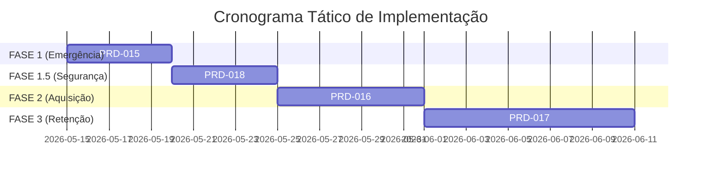

# Roadmap Estratégico de Crescimento e Conversão 🚀📈

> **Responsável:** @maestro (Orquestrador Central)  
> **Data:** 15 de Maio de 2026  
> **Aprovado para:** InviteEventAI (Fase Pré-Lançamento & Tração)  
> **Objetivo:** Resolver a ansiedade de aquisição de clientes organicamente, acelerar a conversão de presentes para casamentos iminentes e gerar fidelização extrema através de inteligência analítica.

---

## 📅 Visão Geral da Esteira de Entregas

Dividimos o escopo prioritário em 3 Fases Táticas independentes, endereçando diretamente as dores imediatas de fluxo de caixa dos noivos e as dores de longo prazo de crescimento do SaaS.

---

## 🚨 FASE 1: Emergência de Conversão (O Booster dos 30 Dias)
* **Foco:** Fazer o dinheiro acontecer AGORA. Ideal para casamentos próximos (30 dias) com 0 presentes adquiridos.
* **PRD Correspondente:** `PRD-015`
* **Ações Práticas:**
  1. **Opção A.1 (FOMO Ativo):** Injeção de tags visuais de urgência e prova social nos cards de presentes na vitrine pública (ex: *"🔥 2 pessoas visualizando agora"* ou *"⚡ Favorito da lista"*).
  2. **Opção 7 (Vitrine Autônoma Light):** Algoritmo simples que empurra itens com mais cliques/interesses para o topo da lista automaticamente.
  3. **Opção A.2 (Sugestor de Acessibilidade):** Feedback instantâneo no Admin recomendando dividir itens estagnados em cotas ou reajustar para faixas de maior giro na região.
* **🔑 Meta de Impacto:** Destravar a primeira compra em casamentos zerados em até 72 horas após deploy.

---

## 🛡️ FASE 1.5: Blindagem de QA (Enterprise Hardening)
* **Foco:** Garantir que o sucesso não quebre a máquina. Segurança absoluta em transações e picos de tráfego.
* **PRD Correspondente:** `PRD-018`
* **Ações Práticas:**
  1. **Stress Testing (100x Scenarios):** Expansão da suíte E2E para cobrir 100+ cenários, incluindo falhas de rede, timeouts de pagamento e concorrência massiva de estoque.
  2. **Negative Flow Certification:** Testes automatizados para todos os estados de erro (404s, 500s controlados, validações de formulários).
  3. **Mobile Swipe & Interaction Audit:** Auditoria completa de usabilidade e gestos em dispositivos reais via Playwright Mobile Emulation.
* **🔑 Meta de Impacto:** Reduzir a taxa de bugs reportados em produção para < 1% e garantir 99.9% de uptime em fluxos transacionais.

---

## 📣 FASE 2: Motor Viral (Aquisição Orgânica Autossuficiente)
* **Foco:** Resolver a ansiedade de tráfego e captação de novos casais sem gastar R$ 1,00 em anúncio pago.
* **PRD Correspondente:** `PRD-016`
* **Ações Práticas:**
  1. **Opção 9 (Instagram Stories Generator):** Criação de uma funcionalidade nativa no painel do admin que renderiza templates de altíssima fidelidade visual (estilo Canva).
  2. **Dynamic Assets:** Geração automática de imagens com o QR Code estilizado do casal, contagem regressiva estilizada e fotos do casal em molduras de luxo.
  3. **Link-in-Bio Booster:** Um botão "Baixar para Postar no Stories" estimulando a divulgação orgânica para toda a base de seguidores dos noivos (o que inclui dezenas de outros noivos potenciais).
* **🔑 Meta de Impacto:** Garantir que todo casal vire um micro-influenciador da sua marca na sua rede social.

---

## 🧠 FASE 3: O Observador Psicológico (Customer Success de Elite)
* **Foco:** Encantamento do organizador. Gerar o efeito *"WOW, essa ferramenta mudou meu casamento"*, alimentando o boca a boca.
* **PRD Correspondente:** `PRD-017`
* **Ações Práticas:**
  1. **Opção 6 (Baldes Psicológicos):** Segmentação em tempo real da base de convidados no dashboard administrativo.
     * **O Quente:** Interagiu com a cesta de compras mas desistiu (precisa de suporte).
     * **O Esquecido:** Leu o convite múltiplas vezes mas não deu RSVP (precisa de lembrete).
     * **O Alheio:** Nunca clicou (precisa de reenvio por SMS/WhatsApp).
  2. **Smart Nudge Button:** Botão ao lado do convidado no admin: *"Cobrar Gentilmente via WhatsApp"*, que já abre o WhatsApp Web com uma mensagem pré-formatada personalizada baseada no comportamento dele.
* **🔑 Meta de Impacto:** Reduzir em 90% o atrito e o estresse dos noivos cobrando confirmações.

---

## 🎻 Parecer do MAESTRO

Este plano de jogo está balanceado para equilibrar **Saúde Financeira Imediata dos Usuários (Fase 1)**, **Crescimento Comercial da Plataforma (Fase 2)** e **Diferencial Competitivo Único no Mercado (Fase 3)**.

Estamos prontos para acionar a fase de **DESCOBERTA (@ba)** da **Fase 1** imediatamente para criarmos a especificação do PRD-015!
