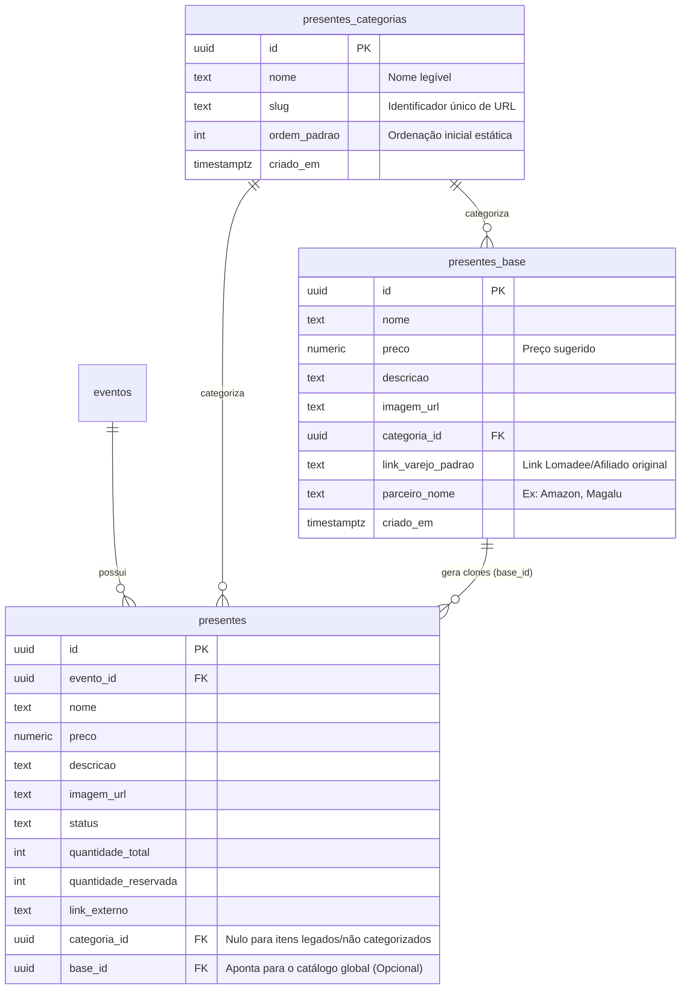

# Arquitetura Técnica: Smart Gift List — Bloco A: A Fundação Inteligente
> **Status:** EM DESENHO  
> **Fase:** ARQUITETURA (PRD-012-A)  
> **Autor:** @architect  

Este documento estabelece as decisões de engenharia de dados, modelagem e serviços para a Fase A do PRD-012. O foco é a fundação do ecossistema SaaS, modelando as tabelas do catálogo padrão, clonagem rápida de itens e motor dinâmico de categorização.

---

## 1. Modelagem do Banco de Dados (Supabase / PostgreSQL)

Para garantir que a nova experiência de **Sugestões de Presentes** opere em sintonia com o sistema legado de presentes, estendemos o esquema atual adicionando uma taxonomia canônica de categorias e a tabela mestra de itens SaaS.

### Diagrama Entidade-Relacionamento (DER)


---

## 2. Decisões de Engenharia de Dados

### DA-01: A Tabela de Categorias Canônica
Ao invés de armazenar a categoria como texto puro (`text`), criaremos a tabela `public.presentes_categorias`. Isso viabiliza o algoritmo de ordenação dinâmica de forma centralizada e evita quebras por erros de digitação de slugs.
*   **Seed Inicial:** Povoado obrigatoriamente com os 8 pilares definidos no PRD (Cozinha, Eletrodomésticos, Cama/Mesa/Banho, etc).

### DA-02: A Arquitetura de Cópia (Clone Patterns)
Para a funcionalidade de **"Adicionar à Minha Lista"**:
*   **Implementação:** Quando o casal clica em Adicionar, criamos um novo registro em `public.presentes`.
*   **Campos Copiados:** Copiamos os valores exatos de `nome`, `preco`, `descricao`, `imagem_url`, `categoria_id` e `link_varejo_padrao` (salvo no campo legado `link_externo`) do registro pai em `presentes_base`.
*   **Rastreabilidade:** Preenchemos o campo `base_id` referenciando o pai. Isso permite ao motor de Inteligência da Fase C rastrear erros/atualizações de preços no pai e notificar/atualizar o filho de forma granular!

### DA-03: Ordenação Dinâmica de Categorias (UX Viva)
A ordenação de categorias para o Convidado deve priorizar categorias mais ativas no casamento.
*   **Algoritmo de Score:** 
    *   `ClicksWeight` (40%): Registros na tabela `analytics_events` com categoria = `'gift'` associados àquele evento e àquela categoria específica.
    *   `ReceivedWeight` (60%): Volume de presentes daquela categoria marcados como reservados/recebidos.
*   **Implementação via SQL View:** Criaremos a view `public.view_presentes_categoria_ranking` que calcula essa pontuação em tempo real por `evento_id` e fornece a lista ordenada de categorias para a API do frontend consumir instantaneamente.

---

## 3. Segurança e RLS (Row Level Security)

Novas tabelas obedecem estritamente ao rigor de governança do projeto:

1.  **`public.presentes_categorias`**:
    *   `SELECT`: Permitido publicamente (`true`), qualquer convidado ou usuário deslogado precisa ler as categorias.
    *   `ALL`: Somente usuários com permissão `is_master = true` (SuperAdmins).
2.  **`public.presentes_base`**:
    *   `SELECT`: Autenticados (casais logados precisam ler o catálogo para importar).
    *   `ALL`: Somente `is_master = true`.

---

## 4. 🛡️ Proteção de Produção e Retrocompatibilidade (Zero Downtime)

Para garantir que o casamento ativo em produção continue operando 100% sem sofrer qualquer impacto adverso, as seguintes diretrizes foram integradas no design:

1.  **Colunas Nullable em `public.presentes`**: As novas colunas `categoria_id` e `base_id` são declaradas explicitamente como `NULLABLE`. Isso garante que NENHUM insert legado ou registro existente de presentes quebrará na migração.
2.  **Fallback de Frontend (Null Safety)**: A UI do Admin e a Vitrine do Convidado devem prever presentes sem categorias (itens legados preexistentes). Caso `categoria_id` seja nulo, o frontend tratará o item sob a categoria virtual **"Outros"** ou exibirá no grid geral automaticamente.
3.  **Migração Não-Bloqueante**: A DDL apenas adiciona colunas e tabelas novas. Não há comandos destrutivos (`DROP`, `ALTER TYPE`, `RENAME`), garantindo compatibilidade com a versão atual da aplicação Vercel enquanto a nova build é implantada.
4.  **Preservação de Regras de Negócio**: As colunas legadas `link_externo`, `status`, `quantidade_total` permanecem intocadas.

---

## 5. Evolução do Esquema (DDL Preliminar)

```sql
-- 1. Criar Tabela de Categorias
CREATE TABLE IF NOT EXISTS public.presentes_categorias (
    id UUID PRIMARY KEY DEFAULT gen_random_uuid(),
    nome TEXT NOT NULL,
    slug TEXT NOT NULL UNIQUE,
    ordem_padrao INT DEFAULT 0,
    criado_em TIMESTAMPTZ DEFAULT now()
);

-- 2. Criar Tabela do Catálogo Global (Base)
CREATE TABLE IF NOT EXISTS public.presentes_base (
    id UUID PRIMARY KEY DEFAULT gen_random_uuid(),
    nome TEXT NOT NULL,
    preco NUMERIC NOT NULL,
    descricao TEXT,
    imagem_url TEXT,
    categoria_id UUID REFERENCES public.presentes_categorias(id) ON DELETE RESTRICT,
    link_varejo_padrao TEXT,
    parceiro_nome TEXT,
    criado_em TIMESTAMPTZ DEFAULT now()
);

-- 3. Modificar Tabela Legada de Presentes para Suportar Fundação
ALTER TABLE public.presentes 
ADD COLUMN IF NOT EXISTS categoria_id UUID REFERENCES public.presentes_categorias(id) ON DELETE SET NULL,
ADD COLUMN IF NOT EXISTS base_id UUID REFERENCES public.presentes_base(id) ON DELETE SET NULL;

-- 4. Habilitar RLS
ALTER TABLE public.presentes_categorias ENABLE ROW LEVEL SECURITY;
ALTER TABLE public.presentes_base ENABLE ROW LEVEL SECURITY;

-- 5. Políticas Básicas de RLS
CREATE POLICY "Leitura pública de categorias" 
ON public.presentes_categorias FOR SELECT USING (true);

CREATE POLICY "Leitura de catálogo base por casais logados" 
ON public.presentes_base FOR SELECT USING (auth.role() = 'authenticated');

-- Master Rules
CREATE POLICY "Modificações permitidas apenas para Masters (Categorias)"
ON public.presentes_categorias FOR ALL USING (
    EXISTS (
        SELECT 1 FROM public.perfis 
        WHERE perfis.id = auth.uid() AND perfis.is_master = true
    )
);

CREATE POLICY "Modificações permitidas apenas para Masters (Catalogo Base)"
ON public.presentes_base FOR ALL USING (
    EXISTS (
        SELECT 1 FROM public.perfis 
        WHERE perfis.id = auth.uid() AND perfis.is_master = true
    )
);
```
