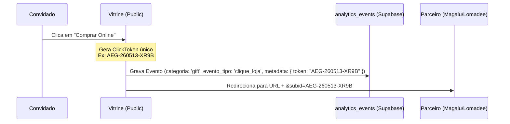
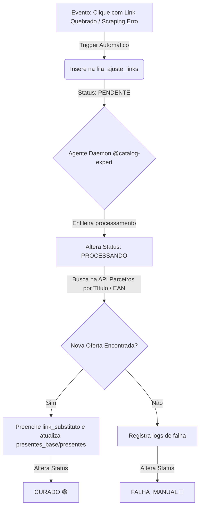

# PRD Refinado: Smart Gift List — Cérebro Autônomo & Self-Healing (PRD-012-C)

> **Status:** 🔍 AGUARDANDO VALIDAÇÃO DO OPERADOR (Fase DESCOBERTA)  
> **Orquestrador:** @maestro  
> **Especialista Principal:** @catalog-expert (Automação & Observabilidade)  
> **Fase de Entrega:** Milestone C (Conclusão do Ciclo de Inteligência)

---

## 1. Objetivo e Visão Geral
O objetivo do Bloco C é transformar a Smart Gift List de uma ferramenta assistida em um **organismo autônomo e resiliente**. Através da automação em segundo plano do `@catalog-expert`, a plataforma vigiará o catálogo base global, garantirá sempre o **Menor Preço + Frete** e autorregenerará links corrompidos (HTTP 404) sem intervenção manual, registrando toda a esteira de raciocínio da IA no Cockpit administrativo para auditoria.

Adicionalmente, consolidaremos o controle financeiro do Master permitindo a **reconciliação offline de faturamento de afiliados**, unificando rastreamento de tokens de cliques e uploads mensais de fechamento de comissões (ex: Lomadee).

---

## 2. Requisitos Funcionais e Jornadas

### RF01 - Fila de Reparação Atômica (Self-Healing Engine)
Sempre que um convidado for impactado por um link inválido (detectado via gateway de clique ou scraping prévio), o sistema deve acionar a auto-recuperação imediata.

*   **Captura Dinâmica:** Um erro no clique insere automaticamente um registro em `public.fila_ajuste_links`.
*   **Máquina de Estados de Cura:** 
    `PENDENTE` ➡️ `EM_ANALISE` ➡️ `CURADO` | `FALHA_MANUAL`.
*   **Cura Autônoma:** O daemon `@catalog-expert` lê as entradas da fila, extrai o nome/categoria e faz requisições de fallback no catálogo parceiro ativo procurando a nova oferta viável mais próxima. Se encontrar, substitui o link no catálogo base e no presente individual correspondente.
*   **Audit Trail (Json Logs):** O processo salva no banco os passos do "pensamento" da IA para ser exibido ao administrador no painel.

### RF02 - Otimização Dinâmica de Custo Total (Menor Preço SaaS Global)
Garantir que a plataforma sempre recomende o menor preço para proteger o bolso do convidado e maximizar conversões de afiliados.

*   **Watchlist Inteligente:** A tabela `public.watchlist_itens` rastreia diariamente o catálogo SaaS de itens base (`presentes_base`).
*   **Custo Logístico:** Se a API fornecer estimativas de frete para CEPs centrais, calcula: `Custo Real = Preço Vitrine + Média Frete`.
*   **Promoção do Melhor Link:** O sistema prioriza dinamicamente na vitrine global o parceiro campeão de Menor Preço Real, rebaixando concorrentes mais caros.

### RF03 - Reconciliação de Comissões via Upload de CSV (Offline Mapping)
Dar observabilidade total de receita e conversão ao Master.

*   **Geração de Token de Rastreio:** No momento do clique no "Comprar Online", o sistema gera um identificador de rastreio único (`click_token`) no formato `AEG-{TIMESTAMP}-{RANDOM}`, salvando-o na coluna `metadata` da tabela `analytics_events`.
*   **Interface Drag-and-Drop:** Interface de upload no painel administrativo para processar relatórios mensais de conversões (no padrão da Lomadee).
*   **Motor de Matching:** A IA processa o CSV, localiza a linha com o `click_token` na base e associa a comissão recebida ao evento e presente originais, atualizando métricas globais de faturamento.

### RF04 - Expansão do Cockpit Master Intelligence
Adição de uma nova aba central no Cockpit: **"Cura de Catálogo & Monetização"**.

*   **Painel de Observabilidade de Cura:** Tabela viva mostrando erros de links, links de substituição sugeridos pela IA e botões de *"Aprovar Correção"* ou *"Rejeitar"*.
*   **Painel de Faturamento Offline:** Tabela de upload de extratos e exibição de comissões consolidadas.

---

## 3. Modelagem de Dados (DDL Consolidado)

Aproveitaremos a infraestrutura atual e criaremos estruturas leves focadas em logs de automação e acompanhamento de preços.

```sql
-- ============================================================================
-- 1. TABELA: public.watchlist_itens
-- Rastreamento diário de menor preço SaaS para o catálogo base.
-- ============================================================================
CREATE TABLE public.watchlist_itens (
    id uuid DEFAULT gen_random_uuid() PRIMARY KEY,
    presente_base_id uuid REFERENCES public.presentes_base(id) ON DELETE CASCADE,
    preco_base_original numeric NOT NULL,
    menor_preco_encontrado numeric,
    loja_campea text,
    link_parceiro_atual text,
    frete_estimado numeric,
    ultima_verificacao timestamptz DEFAULT now(),
    criado_em timestamptz DEFAULT now()
);

-- Habilita RLS (Apenas admins Master lêem/escrevem)
ALTER TABLE public.watchlist_itens ENABLE ROW LEVEL SECURITY;
CREATE POLICY "Master controle total watchlist" 
ON public.watchlist_itens FOR ALL
USING (EXISTS (SELECT 1 FROM public.perfis WHERE id = auth.uid() AND is_master = true));

-- ============================================================================
-- 2. TABELA: public.fila_ajuste_links
-- Registros de quebra de integridade e passos do Self-Healing.
-- ============================================================================
CREATE TABLE public.fila_ajuste_links (
    id uuid DEFAULT gen_random_uuid() PRIMARY KEY,
    presente_base_id uuid REFERENCES public.presentes_base(id) ON DELETE SET NULL,
    presente_id uuid REFERENCES public.presentes(id) ON DELETE SET NULL,
    link_quebrado text NOT NULL,
    motivo_quebra text NOT NULL, -- Ex: 'HTTP_404', 'ESTOQUE_ESGOTADO'
    status text NOT NULL DEFAULT 'PENDENTE', -- 'PENDENTE', 'PROCESSANDO', 'CURADO', 'FALHA_MANUAL'
    link_substituto text,
    logs_cura jsonb DEFAULT '[]'::jsonb, -- Guarda histórico dos passos da IA
    criado_em timestamptz DEFAULT now(),
    atualizado_em timestamptz DEFAULT now()
);

-- Habilita RLS (Público pode INSERIR via cliques rotos, Master faz o resto)
ALTER TABLE public.fila_ajuste_links ENABLE ROW LEVEL SECURITY;

CREATE POLICY "Qualquer um reporta links quebrados"
ON public.fila_ajuste_links FOR INSERT
WITH CHECK (true);

CREATE POLICY "Master le e atualiza fila"
ON public.fila_ajuste_links FOR ALL
USING (EXISTS (SELECT 1 FROM public.perfis WHERE id = auth.uid() AND is_master = true));

-- Trigger para atualização automática do timestamp 'atualizado_em'
CREATE OR REPLACE FUNCTION update_fila_ajuste_timestamp()
RETURNS TRIGGER AS $$
BEGIN
   NEW.atualizado_em = now();
   RETURN NEW;
END;
$$ language 'plpgsql';

CREATE TRIGGER trg_update_fila_ajuste
BEFORE UPDATE ON public.fila_ajuste_links
FOR EACH ROW EXECUTE FUNCTION update_fila_ajuste_timestamp();
```

---

## 4. Fluxo Técnico de Operação

### A. Rastreamento de Cliques e Tokenização (Front/Back)


### B. Máquina de Cura Autônoma (Self-Healing Daemon)


---

## 5. Critérios de Aceite Técnicos
1. **T1 (Fila de Ajuste)**: Uma simulação de clique roto (HTTP 404) deve popular a tabela `fila_ajuste_links` instantaneamente via RLS.
2. **T2 (Self-Healing)**: O processo autônomo simulado pelo daemon deve conseguir ler uma quebra e registrar a nova URL curada mudando o status para `CURADO`.
3. **T3 (Rastreabilidade de Logs)**: O JSON de logs de cura deve refletir de forma amigável os 4 passos do rastreio para exibição na UI.
4. **T4 (Matching de Token)**: O upload de um mock do CSV de faturamento deve bater o `click_token` com o `metadata->token` do `analytics_events` registrando a conversão sem duplicidades.
