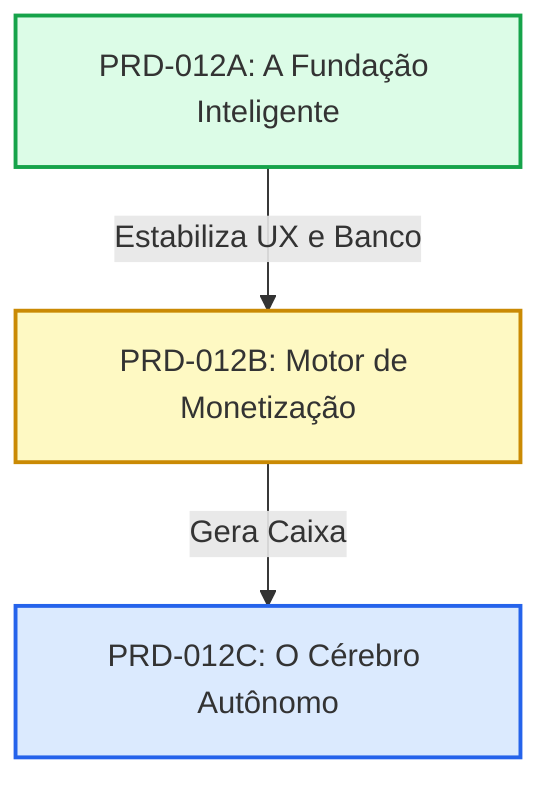

# Estratégia de Fatiamento — PRD-012 (Decomposição em Fases Mínimas)
> **Orquestrador:** @maestro  
> **Fase:** PLANEJAMENTO DE ENTREGAS  
> **Data:** 13/05/2026  

O PRD-012 cresceu e tornou-se um ecossistema massivo. Para garantir a **velocidade de entrega**, a **estabilidade contínua** e a **ausência de regressões** (seguindo os princípios DevOps que restabelecemos na v0.3.3), a melhor estratégia é fatiar o escopo em **três blocos evolutivos e independentes**.

Abaixo, apresento a arquitetura de fatiamento baseada em valor de negócio (Value First) e risco tecnológico (Risk Last).

---

## 🗺️ Plano de Decomposição: Do MVP ao Autônomo

---

## 🥇 Fase 1 — PRD-012A: Fundação Inteligente & One-Click 
> **Foco:** Destravar a adoção. Facilitar exponencialmente a vida do casal e organizar a vitrine.
*   **O que entra:**
    1.  Taxonomia de Categorias (8 a 12 categorias canônicas) e ordenação dinâmica de abas no convidado.
    2.  Tabela de Catálogo Base Global (`presentes_base`) populada por Seed.
    3.  Experiência de **Cadastro em 1 Clique** no Painel Administrativo do Casal.
    4.  Widget de Tendências Diárias no Dashboard.
*   **Por que primeiro?** Porque não depende de integrações complexas de APIs externas, não depende de redirecionamento de rede e gera **valor imediato** e visual para o primeiro cliente do SaaS.

---

## 🥈 Fase 2 — PRD-012B: Gateway de Monetização & Reservas
> **Foco:** Começar a gerar receita (Monetizar o tráfego existente).
*   **O que entra:**
    1.  A Tabela de Regras Dinâmicas de Lojas (`plataformas_afiliados`) para o motor de RegEx.
    2.  O **Intersticial de Rastreio (3s)** e a trava curta de estoque (3 Horas).
    3.  A integração do Redirect com injeção da tag Lomadee e UUID de clique (SubIDs).
    4.  A notificação integrada e o botão **Cancelar Reserva (Self-Release)** no card do convidado.
*   **Por que segundo?** Com a vitrine pronta na Fase 1, aplicamos a camada de monetização sobre o tráfego ativo. Começamos a mapear cliques e reservas.

---

## 🥉 Fase 3 — PRD-012C: O Cérebro Autônomo (Self-Healing)
> **Foco:** Escalar com inteligência Artificial. Otimizar custos e reduzir o suporte ao cliente (Zero Maintenance).
*   **O que entra:**
    1.  O Agente de Catálogo Autônomo (`@catalog-expert`) ativo.
    2.  A tabela de **Watchlist diária** de preços e dedup inteligente.
    3.  A **Fila de Ajuste de Links** e o mecanismo de autorregeneração (Cura Autônoma de 404).
    4.  A atualização final da tela de **Master Intelligence** (Upload do CSV Lomadee e logs de Observabilidade).
*   **Por que por último?** Porque a inteligência artificial e os bots autônomos precisam de uma infraestrutura de dados madura (tabelas de cliques, logs e gateway de redirect) pronta para poderem analisar e operar em cima.

---

## 🚦 Recomendações do Maestro para Validarmos Agora

1.  **Fatiamento Imediato:** Se você validar esse desenho, eu irei quebrar o PRD-012 inicial nos arquivos `docs/prd/prd-012-a/`, `docs/prd/prd-012-b/` e `docs/prd/prd-012-c/`.
2.  **Início Ágil:** Iniciaremos o ciclo de desenvolvimento **IMEDIATAMENTE** apenas pela Fase A. O **@dev** e o **@ux-ui** terão um escopo enxuto, 100% claro e rápido de testar e subir para a v0.3.4!

Esta estratégia de faseamento faz sentido para o ritmo atual do negócio?
