# 🎻 PRD-017: O Observador Psicológico (Termômetro de Convidados & Smart Nudges)

> **Status:** DESCOBERTA (Em Discussão)  
> **Autor:** `@ba` (Business Analyst)  
> **Orquestrador:** `@maestro`  
> **Fase:** Fase 3 (Retenção & CS de Elite)  
> **Versão:** `1.0-draft`  
> **Data:** 17 de Maio de 2026  

---

## 📖 1. Visão Geral & Dor de Negócio

Uma das maiores dores operacionais e psicológicas enfrentadas por casais de noivos durante a preparação do casamento é a **ansiedade de confirmação de presença (RSVP)** e a **conversão da lista de presentes**.
* **A Procrastinação dos Convidados:** Convidados frequentemente abrem o site, leem os detalhes, entram na lista de presentes, mas procrastinam a finalização da confirmação ou a compra da cota.
* **O Desconforto da Cobrança:** Os noivos acham extremamente desconfortável ter que enviar mensagens cobrando presença de amigos e familiares. Fazer isso de forma genérica soa impessoal, e manualizar a personalização toma horas de trabalho emocional.
* **A Solução (O Observador Psicológico):** Prover inteligência e segmentação comportamental silenciosa para que os noivos saibam exatamente o "status de engajamento" de cada convidado e possam agir com **Smart Nudges** (mensagens personalizadas de 1-clique via WhatsApp baseadas em comportamento de navegação), eliminando o desconforto e acelerando a conversão de forma carinhosa e sutil.

---

## 🏆 2. Objetivos de Negócio

1. **Acelerar a Confirmação de Presença:** Reduzir o tempo médio de resposta de RSVP pendente dos convidados.
2. **Maximizar Conversão de Presentes:** Reduzir o abandono de cesta/carrinho na lista de presentes (cotas abandonadas).
3. **Reduzir o Atrito de Cobrança:** Fornecer aos noivos ferramentas acionáveis que simplificam a comunicação sem parecer uma "cobrança agressiva".
4. **Gerar Insights Visuais:** Criar um "Termômetro" no painel admin que indique a temperatura de engajamento geral do casamento.

---

## 🎨 3. Definição dos Baldes Psicológicos (Segmentação em Tempo Real)

Rastrearemos o comportamento do convidado silenciosamente através de cookies leves e telemetria por slug exclusivo de convite. Cada convidado será classificado em um **"Balde Psicológico"**:

| Balde | Nome Visual | Status Interno | Regra de Classificação | Mensagem Alvo (Nudge) |
|---|---|---|---|---|
| 🔴 **O Alheio** | Pendente Silencioso | `alheio` | `status_rsvp = 'pendente'` AND `cliques_convite = 0` | Lembrar carinhosamente do convite enviado e convidar a ver as fotos/mural. |
| 🟡 **O Esquecido** | Leitor Pendente | `esquecido` | `status_rsvp = 'pendente'` AND `cliques_convite >= 2` AND `tempo_sessao_acumulado >= 30s` | Lembrar sobre o prazo limite de confirmação que está se aproximando. |
| 🟢 **O Quente** | Quase Confirmado / Abandonou Presente | `quente` | `status_rsvp = 'pendente'` AND `clique_presentes >= 1` | Apoiar na navegação do site e perguntar se teve alguma dúvida com a lista de presentes ou o RSVP. |
| 🎉 **O Confirmado** | Convidado VIP | `confirmado` | `status_rsvp = 'confirmado'` | Nenhuma ação de cobrança necessária. (Opcional: Agradecer e sugerir postar uma mídia no Story Maker). |

---

## 🏗️ 4. Abertura do Escopo: Opções Arquiteturais

Para atender à solicitação de "abrir bastante o escopo e avaliar todas as opções", o time de negócios e arquitetura mapeou **três abordagens técnicas distintas** com diferentes níveis de complexidade, esforço, custo e valor gerado:

```mermaid
graph TD
    subgraph Opção A
    A1[Session Storage Local] --> A2[Admin lê do LocalStorage do Convidado?]
    A2 --> A3[Link do WhatsApp Manual sem BD]
    end

    subgraph Opção B - Recomendada
    B1[Telemetria Supabase por Slug] --> B2[Tabela convite_logs]
    B2 --> B3[Painel Admin Consolidado]
    B3 --> B4[WhatsApp Web Link de 1-Clique]
    end

    subgraph Opção C
    C1[Eventos Cloud / WebSockets] --> C2[Notificações Push / SMS]
    C2 --> C3[WhatsApp API Oficial Automatizado]
    end
```

---

### 🟢 Opção A: "Leve e Rápido" (Foco em Cookies & LocalStorage Local)
* **Como Funciona:** O rastreamento é feito inteiramente no lado do cliente (navegador do convidado) via `LocalStorage`. Quando o convidado entra pelo seu link (`/inv/slug-exclusivo`), o navegador registra cliques e páginas visualizadas em chaves locais.
* **Envio de Mensagens:** No painel administrativo, há uma lista genérica de botões do WhatsApp com links `api.whatsapp.com` estáticos baseados em templates globais. Os noivos copiam e colam de forma genérica.
* **Prós:**
  * Custo de infraestrutura **zero**.
  * Rápida implementação (esforço XS).
  * Sem preocupações com banco de dados Supabase ou consumo de linha de dados.
* **Contras:**
  * **Sem persistência cruzada:** Se o noivo abrir o painel administrativo de outro computador/celular, ele não verá a telemetria do convidado (pois os dados estão apenas no dispositivo do convidado).
  * Impossível compilar métricas agregadas do casamento no banco.
  * Baixo valor agregado e pouca inteligência.

---

### 🔵 Opção B: "Engajamento Consolidado" (Telemetria Supabase + Smart Nudge Web Link) — **[RECOMENDADA]**
* **Como Funciona:** 
  1. Criamos a tabela `convite_logs` no Supabase com RLS seguro. Cada interação do convidado (ex: abrir o link, navegar para presentes, abrir FAQ, tentar preencher RSVP) gera um registro associado ao ID do convite.
  2. O Painel Admin compila esses logs e exibe o balde real do convidado em tempo real.
  3. Ao lado do nome do convidado, um botão **"Smart Nudge"** abre um link pré-configurado do WhatsApp (`https://api.whatsapp.com/send?phone=...&text=...`) com um texto personalizado e carinhoso de acordo com o balde do convidado, contendo variáveis dinâmicas (nome do noivo, nome do convidado, slug do convite).
* **Prós:**
  * Paridade total de dados: noivos vêem os mesmos dados de qualquer dispositivo.
  * Inteligência de dados real: exibe gráficos de conversão, contagem de cliques globais e taxa de procrastinação.
  * Custo operacional de envio **zero** (usa a interface padrão do WhatsApp Web do próprio celular dos noivos).
  * Esforço de desenvolvimento moderado (esforço M) com alto impacto de entrega.
* **Contras:**
  * Requer gravação leve no banco Supabase para eventos selecionados (necessário otimizar para evitar concorrência severa sob tráfego massivo).

---

### 🟣 Opção C: "Automação SaaS de Elite" (WhatsApp API Oficial + Auto-Reminders)
* **Como Funciona:** Rastreamento total em banco de dados Supabase. O sistema possui um motor de tarefas agendadas (Cron Jobs / Edge Functions) que monitora os baldes de engajamento automaticamente.
* **Envio de Mensagens:** Se um convidado estiver classificado como *"O Alheio"* por mais de 5 dias, a própria plataforma envia uma mensagem automatizada no WhatsApp do convidado através da API Oficial da Meta (Twilio / Z-API), sem que os noivos precisem clicar em nenhum botão.
* **Prós:**
  * Automação **100% autônoma** (mãos livres para os noivos).
  * Experiência típica de produtos SaaS corporativos premium.
* **Contras:**
  * **Custo financeiro recorrente:** Envio de WhatsApp pela API Oficial ou brokers tem custos por mensagem.
  * **Risco de SPAM:** Mensagens automáticas não solicitadas no WhatsApp podem levar ao banimento do número/conta do evento se os convidados denunciarem.
  * Complexidade arquitetural e esforço extremamente alto (esforço L/XL).

---

## 📊 5. Tabela Comparativa de Opções

| Critério | Opção A (Local) | Opção B (Supabase Telemetry + Web) | Opção C (SaaS Automático) |
|---|---|---|---|
| **Esforço de Dev** | 🟢 Baixo (2-3 dias) | 🟡 Médio (5-7 dias) | 🔴 Alto (15-20 dias) |
| **Custo de Infra** | 🟢 Zero | 🟢 Zero | 🔴 Elevado (Mensagens pagas) |
| **Fidelidade de Dados** | 🔴 Fraca (Local) | 🟢 Excelente (Persistido no BD) | 🟢 Excelente (Persistido no BD) |
| **Persistência Global**| 🔴 Não (Só no device) | 🟢 Sim (Qualquer device) | 🟢 Sim (Qualquer device) |
| **Segurança & SPAM** | 🟢 Segura | 🟢 Segura (Manual dos noivos) | 🔴 Média (Risco de denúncia) |
| **WOW Factor** | 🟡 Baixo | 🟢 Muito Alto | 👑 Máximo |

---

## 📝 6. Especificação dos Templates de "Smart Nudges" (Proposta de Copywriting)

### 🔴 Para "O Alheio" (Nunca abriu o site)
> *"Oi, [Nome Convidado]! Tudo bem? Passando para te lembrar que enviamos o link exclusivo do nosso convite de casamento! Queríamos muito que você desse uma olhada para ver as fotos e nossa contagem regressiva: [URL_Convite]. Um beijo enorme, [Nome Noivo/Noiva]!"*

### 🟡 Para "O Esquecido" (Leu o convite, mas não confirmou)
> *"Oi, [Nome Convidado]! Estamos super animados preparando tudo para o grande dia! Vimos que você já deu uma olhada no nosso site, e queríamos lembrar de forma sutil que o prazo de confirmação de presença (RSVP) está se aproximando. Se puder dar uma passadinha lá para confirmar, nos ajuda muito na contagem do buffet: [URL_Convite]. Contamos com você!"*

### 🟢 Para "O Quente" (Entrou na lista de presentes, mas não confirmou / abandonou)
> *"Oi, [Nome Convidado]! Tudo joia? Vimos que você visitou nossa lista de presentes no site! Esperamos que tenha gostado das opções que escolhemos com tanto carinho. Ficou com alguma dúvida sobre como funciona o envio das cotas ou a confirmação de presença? Se precisar de ajuda com a plataforma ou qualquer detalhe do site, pode nos chamar por aqui! Segue o link para facilitar: [URL_Convite]. Abraços!"*

---

## 🎻 7. Parecer e Questões para o Operador

> [!IMPORTANT]
> A equipe recomenda fortemente a **Opção B (Engajamento Consolidado)**. Ela traz o balanço perfeito de inteligência empresarial, persistência global em banco de dados, custo operacional nulo e zero risco de bloqueio de número do WhatsApp, com esforço de desenvolvimento viável dentro do cronograma do casamento.

### ❓ Questões em Aberto para Validação do Operador:
1. **Escolha da Opção:** Qual das três abordagens arquiteturais (A, B ou C) faz mais sentido estratégico para o momento atual do produto?
2. **Definição de Métricas de Tempo:** Qual o tempo de tolerância ideal para categorizar um convidado como *Esquecido* (ex: 2 dias após a visualização sem confirmar)?
3. **Mecanismo de Logs:** A telemetria deve gravar apenas cliques globais (evento estático) ou dados de tempo de tela cumulativos (sessões ativas)?

---

*Aguardando o direcionamento formal do Operador para movermos esta descoberta para a etapa de **PRD Final** e acionar as especificações de Experiência e Arquitetura!* 🌌🎻 Let's build!
