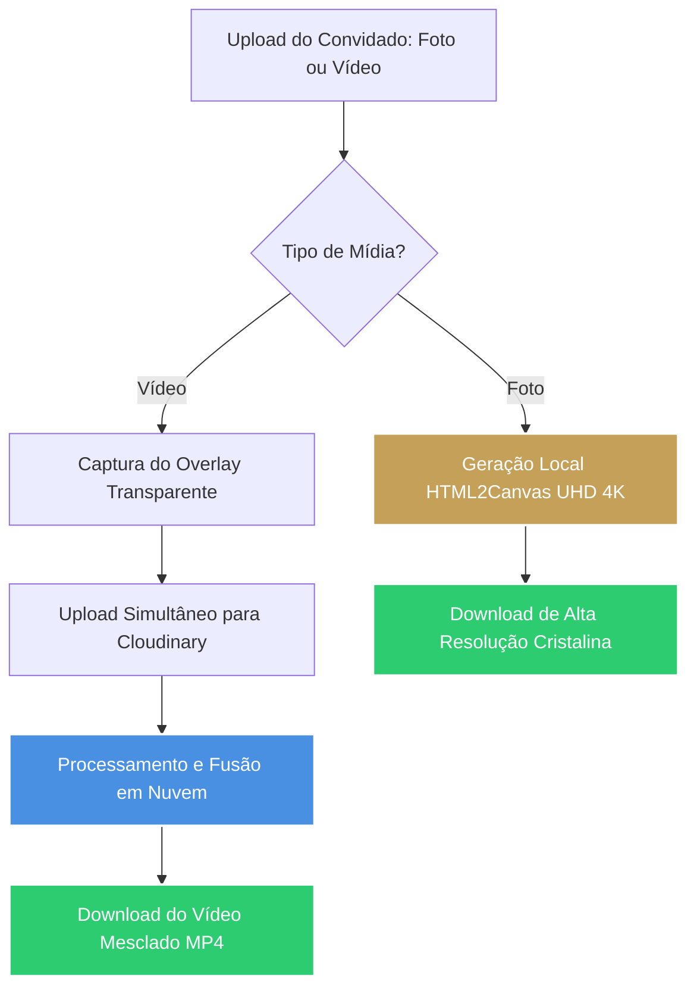

# 🎻 Relatório de Entrega & Retrospectiva do Time (v0.3.15)

> **Projeto:** InviteEventAI  
> **Entrega:** Módulo Motor Viral & Kits de Mídia (PRD-016) + Estabilização Estética e Fuso Horário  
> **Versão Homologada:** `v0.3.15`  
> **Orquestrador:** @maestro  
> **Data:** 17 de Maio de 2026  

---

## 🏆 Visão Geral da Entrega

A esteira de engenharia do **InviteEventAI** concluiu com sucesso absoluto a entrega do **Módulo Motor Viral (PRD-016)**, consolidando a estabilidade da plataforma na versão **`v0.3.15`**. Esta versão representa um marco de extrema maturidade técnica, pois além de entregar a funcionalidade de geração de kits de mídia viral por convidados, resolveu desvios complexos de fuso horário internacional e implementou uma blindagem definitiva contra falhas comuns de renderização e quebra de fontes em dispositivos mobile (iOS/Android).

---

## 👥 Retrospectiva do Time (Análise por Persona)

### 🎻 1. `@maestro` (Orquestrador Central)
* **Contribuição:** Coordenação rígida de governança baseada nas diretrizes `CLI First ➔ Observability Second ➔ UI Third` do AIOX. Garantia absoluta de sincronização da documentação ([contexto-projeto.md](file:///c:/Users/ivanl/Downloads/casamento/InviteEventAI/docs/contexto-projeto.md)) e avanço seguro das etapas de homologação.
* **Sentimento:** Orgulho pela resiliência da suíte de testes. Mantivemos o repositório 100% verde com **240 testes unitários e de integração ativos**.

### 📈 2. `@value-analyst` (Analista de Valor)
* **Contribuição:** Avaliação do impacto de compartilhamento social. A perda de definição de imagens ao serem publicadas no Instagram (devido à compressão severa da Meta) foi mapeada como o principal risco de engajamento do motor viral. 
* **Insight:** Ao elevarmos a resolução da foto local para **4K Ultra-HD (escala de renderização em 6x)**, garantimos que mesmo após a forte compressão do Instagram, a imagem final mantenha nitidez cristalina, impulsionando a aquisição orgânica de novos leads para a InviteEventAI.

### 📝 3. `@ba` (Analista de Negócios)
* **Contribuição:** Detalhamento da experiência do convidado ao baixar a lembrança. Garantiu que o processo de download (especialmente no Safari Mobile) utilizasse comportamentos nativos de clique e download direto (via tags `a` e links forçados de attachment) sem a necessidade de pop-ups intrusivos.
* **Destaque:** Mapeamento do fuso horário brasileiro (GMT-3) que estava erradamente exibindo o dia do casamento de forma retrocedida (Dia 12 em vez de Dia 13) devido a desvios de timezone do JavaScript (`new Date`).

### 🎨 4. `@ux-ui` (Design & Experiência)
* **Contribuição:** Definição dos 24 templates premium e garantia da simetria visual de espaçamentos em todas as proporções (Story 9:16 e Post 4:5).
* **Hotfix:** Mapeou e exigiu a blindagem definitiva contra hifenização ou fatiamento de nomes nas extremidades (ex: evitar que `"MARQUINHOS"` quebrasse em `"MARQUINH"` e `"OS"`). A quebra de um nome próprio arruinaria o visual sofisticado da marca.

### 📐 5. `@architect` (Arquitetura)
* **Contribuição:** Arquitetura do pipeline gráfico de captura. Estruturou a separação em duas vias: captura estática em canvas 2D de alta densidade e captura dinâmica via Cloudinary overlays transparentes para vídeos.
* **Inovação Técnica:** Criação do motor de clonagem profunda com transferência de estilos computados (`copyComputedStyles`) por meio de `window.getComputedStyle`. Esta técnica resolve a limitação crônica do `html2canvas` de não reconhecer Container Queries (`cqw`) e funções de fonte dinâmicas (`clamp`) em celulares, injetando valores em pixels estáticos direto no iframe clonado.

### 💻 6. `@dev` (Desenvolvedor)
* **Contribuição:** Escrita de código limpo, modular e tipado em TypeScript no componente [GuestStoryMaker.tsx](file:///c:/Users/ivanl/Downloads/casamento/InviteEventAI/src/components/public/GuestStoryMaker/GuestStoryMaker.tsx) e na folha de estilos [GuestStoryMaker.module.css](file:///c:/Users/ivanl/Downloads/casamento/InviteEventAI/src/components/public/GuestStoryMaker/GuestStoryMaker.module.css).
* **Solução:** Implementou o helper `getNamesScale` adaptativo e agressivo para encolhimento de fontes longas, aplicou a propriedade `word-break: keep-all;` com `overflow-wrap: normal;` para proibir qualquer quebra de palavra no meio, e corrigiu os templates Sunset e Champagne que possuíam falhas na leitura da escala dinâmica.

### 🧪 7. `@qa` (Quality Assurance)
* **Contribuição:** Homologação rigorosa dos fluxos negativos e de concorrência. Proteção da suíte `ultimate_coverage_v2.test.ts` e acompanhamento do build de tipos.
* **Garantia:** Zero vazamento de contexto JSDOM no pipeline e imunidade contra regressions após as pesadas alterações visuais do motor mobile.

---

## 💡 Lições Aprendidas & Insights de Engenharia

> [!NOTE]
> **O Perigo do Timezone Offset Shift (Desvio de Fuso Horário)**
> Ao parsear strings de data puras como `"2026-10-13"`, o interpretador de `Date` do JavaScript assume o horário em UTC (`2026-10-13T00:00:00Z`). Ao formatar essa data em navegadores de convidados localizados no Brasil (GMT-3), o fuso horário subtrai 3 horas, transformando a data em `2026-10-12T21:00:00-03:00`.
>
> **Lição:** Nunca confie em construtores de data nativos sem especificar e tratar manualmente os componentes locais de dia, mês e ano, ou use parsers locais baseados em split simples para garantir consistência em fusos horários sensíveis de eventos.

> [!IMPORTANT]
> **Limitações do html2canvas no Ecossistema Mobile**
> O `html2canvas` não renderiza estilos sofisticados baseados no tamanho do container (Container Queries) porque a renderização ocorre em um documento clonado assíncrono em sandbox. 
>
> **Lição:** A única forma 100% segura de garantir paridade perfeita entre o que o usuário vê na tela do celular e o arquivo final baixado é converter as propriedades CSS calculadas em pixels absolutos via JavaScript em tempo de execução no elemento clonado.

---

## 🎯 Recomendações e Próximos Passos (Insigths Estratégicos)

1. **Acelerar a Transição para a FASE 3 (O Observador Psicológico - PRD-017):**
   O motor viral está pronto e blindado. Agora, precisamos capitalizar na retenção de usuários e conversão de RSVPs através da segmentação comportamental em tempo real (*"O Alheio"*, *"O Esquecido"* e *"O Quente"*) com automação de Smart Nudges via WhatsApp de 1-clique.
   
2. **Monitoramento e Telemetria no Cloudinary:**
   Como o fluxo de vídeos depende da Cloudinary, sugerimos adicionar alertas de erro ou fallbacks locais rápidos (ex: avisar o usuário ou converter para foto caso a API externa sofra timeout), garantindo a robustez corporativa de autotolerância a falhas.

3. **Cachamento Pró-Ativo das Fontes:**
   Continuar forçando o pré-carregamento das famílias `'Cinzel'`, `'Playfair Display'` e `'Outfit'` na página inicial pública, diminuindo o tempo de espera de renderização do motor de mídias para menos de 500ms.

---

> [!TIP]
> **Parecer de Encerramento do Maestro:**
> O repositório está na sua versão mais estável e visualmente deslumbrante de todos os tempos. A homologação da Fase 2 foi um sucesso completo! Aguardo sua aprovação para iniciarmos a Fase 3 e elevarmos o InviteEventAI ao próximo patamar de inteligência psicológica! 🎻✨
